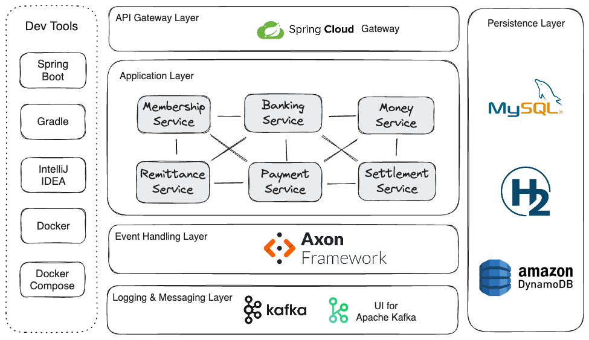
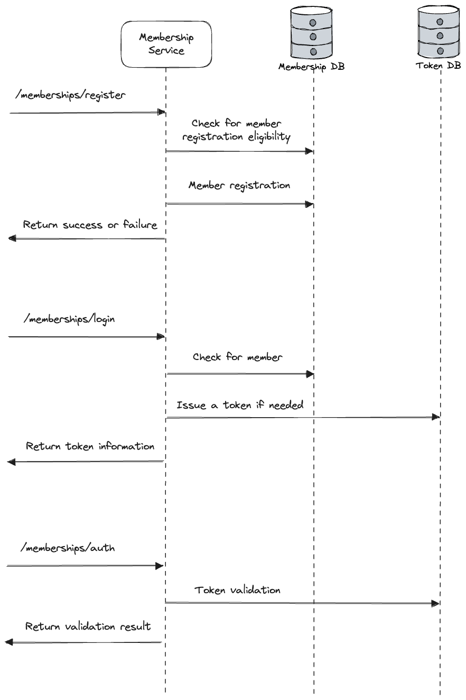
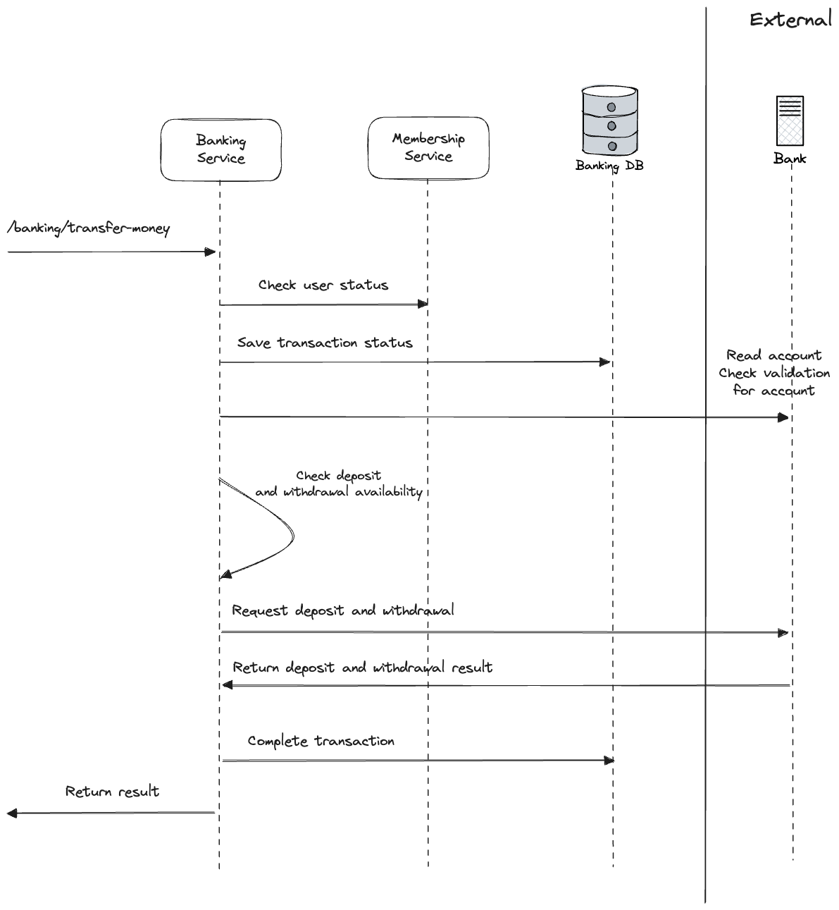
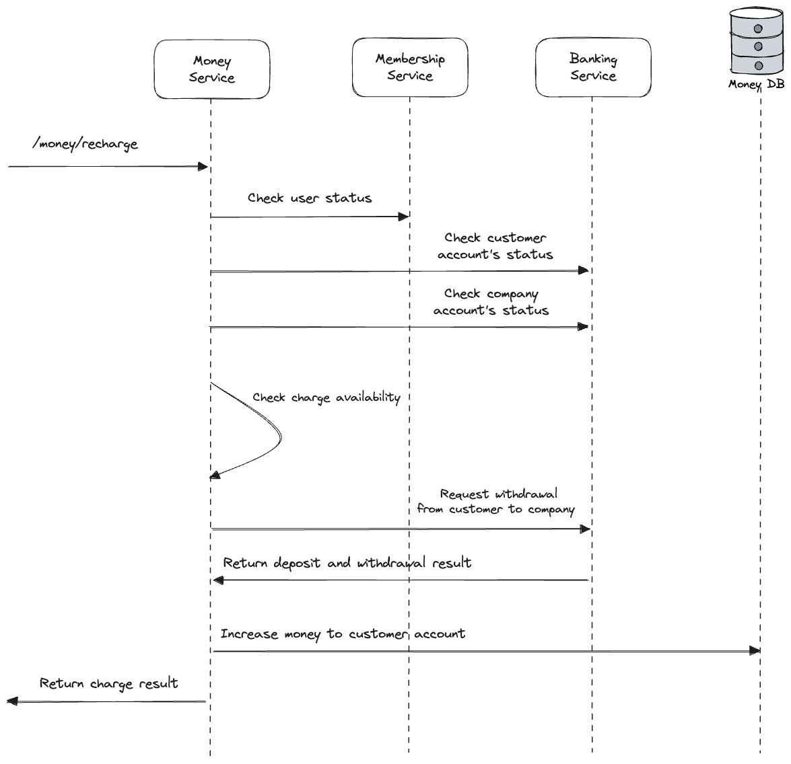
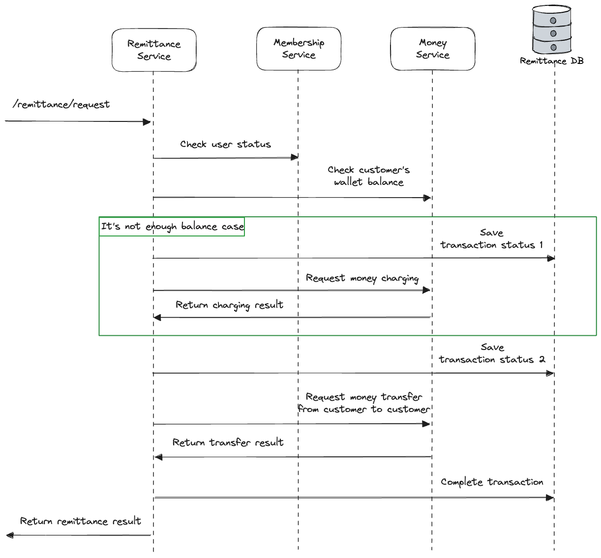
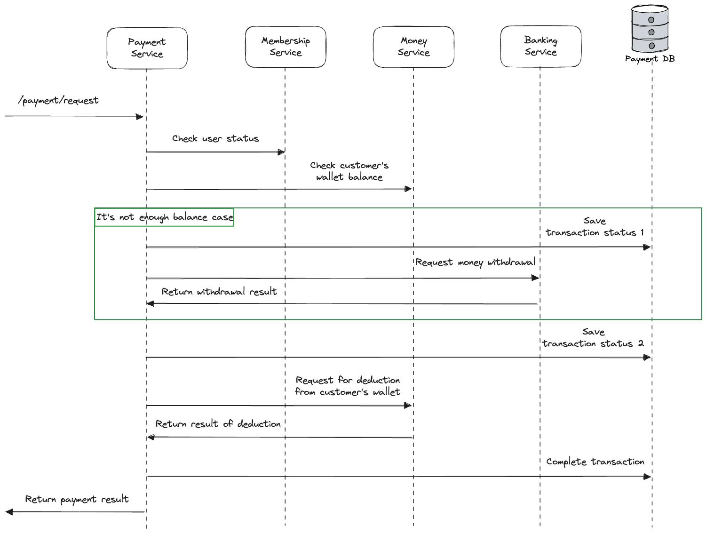
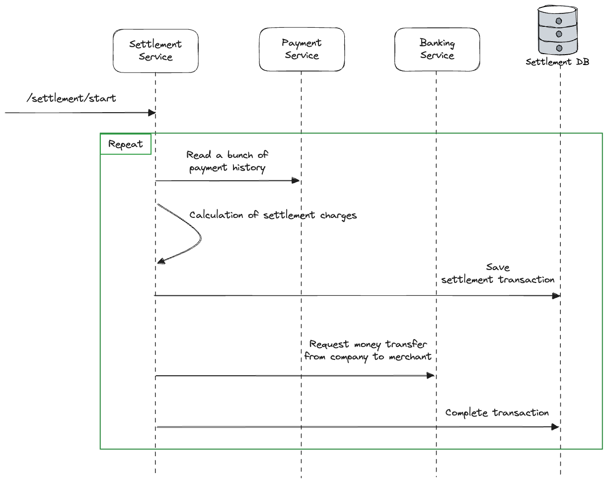

# JayPay Project Overview


```
It consists of six services: Membership, Banking, Money, Remittance, Payment, and Settlement, each configured as an independent project.
Each service implemented basic functionalities using Hexagonal Architecture, and then incorporates features such as EDA, CQRS, Event Sourcing, and the Saga Pattern.

The projects are primarily based on Spring Boot and Java 11, and the Axon Framework v4.6.0 is used to implement EDA.
```

## Using Stack in this project
- Java 11
- Spring Boot, Spring Data JPA
- Lombok
- Gradle
- JWT
- Axon Framework
- Docker, Docker Compose
- Mysql, H2
- AWS DynamoDB

## Sequence Diagram Examples

### Membership service


### Banking service


### Money service


### Remittance service


### Payment service


### Settlement service


## Execution
```
./gradlew docker
docker-compose up -d
```

## Service Endpoint & Swagger UI
- Membership Service
  - http://localhost:8081/memberships
  - http://localhost:8081/swagger-ui.html
- Banking Service
  - http://localhost:8082/banking
  - http://localhost:8082/swagger-ui.html
- Money Service
  - http://localhost:8083/money
  - http://localhost:8083/swagger-ui.html
- Remittance Service
  - http://localhost:8084/remittance
  - http://localhost:8084/swagger-ui.html
- Payment Service
  - http://localhost:8085/payment
  - http://localhost:8085/swagger-ui.html
- Money Aggregation Service
  - http://localhost:8086/money/aggregation
  - http://localhost:8086/swagger-ui.html
- Money Query Service
  - http://localhost:8087/money/query
  - http://localhost:8087/swagger-ui.html
- Settlement Service
  - http://localhost:8088/settlement
  - http://localhost:8088/swagger-ui.html  
- Mysql
  - http://localhost:3306
  - root password: rootpassword
  - database: jaypay
  - User/PW : mysqluser / mysqlpw
- Kafka UI
  - http://localhost:8989
- Axon Server Dashboard
  - http://localhost:8024

## Trouble Shooting
### 1. It needs connection information to use dynamo db.
[MoneyQueryService: DynamoDBAdapter.java]
```
private static final String ACCESS_KEY = "";
private static final String SECRET_KEY = "";
```